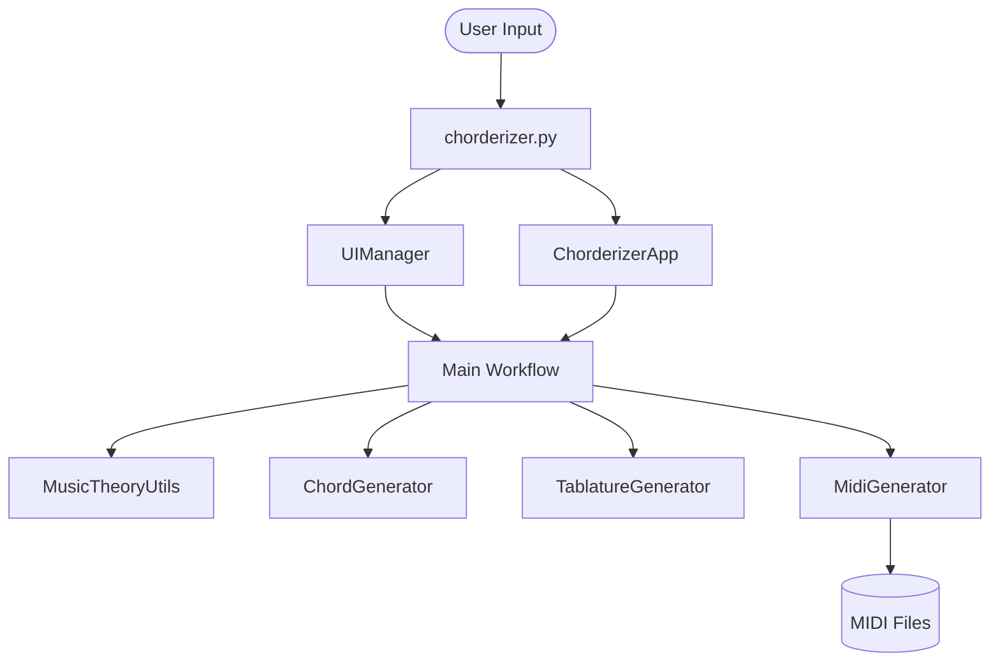

# System Architecture

This document describes the internal structure and design principles of Chorderizer.

## Design Philosophy

Chorderizer follows a **Modular Separation of Concerns** approach to keep music theory logic distinct from generation and presentation.

## Core Modules

### 1. Theory Engine (`theory_utils.py`)

The "brain" of the project.

- **`MusicTheory`**: A static repository of constants (intervals, scales, chord structures, MIDI programs).
- **`MusicTheoryUtils`**: Pure functions for note parsing, transposition logic, and key heuristics.
- *Responsibility*: Ensuring musical correctness.

### 2. Logic Generators (`generators.py`)

Handles the transition from abstract theory to tangible data.

- **`ChordGenerator`**: Calculates MIDI note sequences and voicings for scales based on extensions and inversions. Implements a caching mechanism (`_chord_cache`) to avoid redundant calculations.
- **`MidiGenerator`**: Orchestrates `mido` track creation, arpeggiation, and strumming effects.
- **`TablatureGenerator`**: Maps MIDI notes to a simplified 6-string guitar neck model.

### 3. Classic Orchestration (`ui.py` & `chorderizer.py`)

- **`UIManager`**: Handles the traditional terminal prompts and formatted output using `colorama` and `rich`.
- **`chorderizer.py`**: Coordinates the four-phase workflow for the classic interactive flow and also exposes the modern dashboard launcher.

### 4. Reactive Dashboard (`tui_app.py` & `tui_widgets.py`)

- **`ChorderizerApp`**: Main Textual application. Implements a **Dual-Mode Layout** (Compose/Jam) using `ContentSwitcher`.
- **Custom widgets**: `PianoWidget`, `FretboardWidget` (Responsive/Adaptive), `GuitarTabWidget`, and `ProgressionPanel`.
- **Jam Mode Engine**: Implements dynamic scale filtering based on expert "Mood Presets" and an adaptive rendering system for the fretboard.
- *Responsibility*: Providing the modern terminal UI without mixing presentation logic into the theory or generator modules.

## Data Flow

## Design Notes

- The repository currently maintains two user-facing interaction models: the classic terminal flow and the reactive Textual dashboard.
- The theory and generation layers are shared by both paths.
- Tests primarily protect theory, generators, orchestration helpers, and security-sensitive file handling.

## Voicing Logic

The `ChordGenerator` uses a heuristic to keep voicings around the C4 (MIDI 60) range. It uses a `last_added_midi_note` strategy to ensure notes are always in ascending order, creating basic but playable spread voicings.
